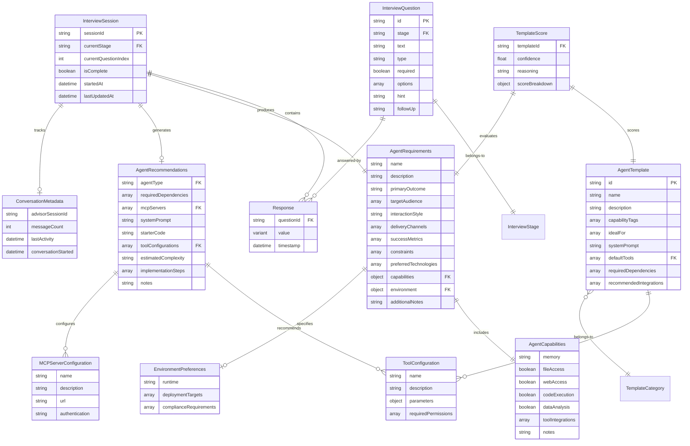

# Agent Advisor Data Model

Comprehensive data model documentation including Entity Relationship Diagrams (ERDs) for database schemas, service models, and UI data structures.

**Last Updated:** 2025-11-02
**Version:** 1.0

---

## Table of Contents

1. [Overview](#overview)
2. [Entity Relationship Diagram (ERD)](#entity-relationship-diagram-erd)
3. [Core Domain Models](#core-domain-models)
4. [Service Layer Models](#service-layer-models)
5. [UI/CLI Data Models](#uicli-data-models)
6. [Data Flow Architecture](#data-flow-architecture)
7. [Persistence Strategy](#persistence-strategy)

---

## Overview

The Agent Advisor application uses a **layered data architecture**:

- **Domain Layer**: Core business entities (AgentRequirements, AgentTemplate, etc.)
- **Service Layer**: Processing models (TemplateScore, CodeGenerationOptions, etc.)
- **Persistence Layer**: Session storage (PersistedState, InterviewState)
- **UI Layer**: CLI interaction models (ConversationMetadata, streaming events)

**Storage Strategy:**
- **File-based**: JSON files in `sessions/` directory (gitignored)
- **In-memory**: Template registry (5 templates loaded at runtime)
- **No database**: Stateless service with session files only

---

## Entity Relationship Diagram (ERD)

### Primary Entities and Relationships



---

## Core Domain Models

### 1. Interview Domain

#### InterviewState
**Purpose**: Tracks the complete state of an interview session
**Location**: `src/types/interview.ts:36-47`

```typescript
interface InterviewState {
  sessionId: string;                          // UUID v4
  currentStage: InterviewStage;               // discovery | requirements | architecture | output | complete
  currentQuestionIndex: number;               // 0-14 (15 questions total)
  responses: Response[];                      // All user answers
  requirements: Partial<AgentRequirements>;   // Collected requirements (built progressively)
  recommendations: AgentRecommendations | null; // Classification results
  isComplete: boolean;                        // Interview finished flag
  startedAt?: Date;                          // Session start timestamp
  lastUpdatedAt?: Date;                      // Last modification timestamp
  conversationMetadata?: ConversationMetadata; // Multi-turn conversation tracking
}
```

**Lifecycle:**
1. **Initialized** → `sessionId` generated, `currentStage: 'discovery'`, `currentQuestionIndex: 0`
2. **In Progress** → Responses collected, requirements built incrementally
3. **Complete** → All 15 questions answered, `isComplete: true`, `currentStage: 'complete'`

#### Response
**Purpose**: Records a single answer to an interview question
**Location**: `src/types/interview.ts:12-16`

```typescript
interface Response {
  questionId: string;                         // Question identifier (e.g., 'agent_name')
  value: string | boolean | string[];         // Answer value (type varies by question)
  timestamp: Date;                            // When answered
}
```

**Value Types by Question Type:**
- `text` → `string`
- `boolean` → `boolean`
- `choice` → `string` (single selection)
- `multiselect` → `string[]` (multiple selections)

#### InterviewQuestion
**Purpose**: Defines a single question in the interview flow
**Location**: `src/types/interview.ts:18-27`

```typescript
interface InterviewQuestion {
  id: string;                    // Unique identifier
  stage: InterviewStage;         // Which stage this belongs to
  text: string;                  // Question text shown to user
  type: QuestionType;            // text | choice | boolean | multiselect
  required: boolean;             // Can user skip?
  options?: string[];            // For choice/multiselect questions
  hint?: string;                 // Help text
  followUp?: string;             // Additional context after answer
}
```

**Question Distribution:**
- **Discovery** (Q1-3): Name, description, primary outcome
- **Requirements** (Q4-9): Audience, interaction style, capabilities
- **Architecture** (Q10-13): Delivery, metrics, constraints, technologies
- **Output** (Q14-15): Environment, additional notes

#### ConversationMetadata
**Purpose**: Tracks multi-turn conversation state across CLI sessions
**Location**: `src/types/interview.ts:29-34`

```typescript
interface ConversationMetadata {
  advisorSessionId: string | null;  // Links to advisor's session ID
  messageCount: number;              // Total messages in conversation
  lastActivity: Date;                // Last interaction timestamp
  conversationStarted: Date;         // Conversation initiation timestamp
}
```

**Usage:**
- Enables session resume across CLI restarts
- Tracks conversation continuity for context preservation
- Integrated with `InterviewStateManager` for automatic updates

---

### 2. Agent Requirements Domain

#### AgentRequirements
**Purpose**: Complete specification of the agent to be built
**Location**: `src/types/agent.ts:19-32`

```typescript
interface AgentRequirements {
  // Core Identity
  name: string;                          // Agent name
  description: string;                   // What it does
  primaryOutcome: string;                // Main goal/deliverable

  // User Context
  targetAudience: string[];              // Who will use it
  interactionStyle: InteractionStyle;    // conversational | task-focused | collaborative
  deliveryChannels: string[];            // Where agent operates (CLI, web, API, etc.)

  // Success Criteria
  successMetrics: string[];              // How performance is measured
  constraints?: string[];                // Limitations/restrictions

  // Technical Preferences
  preferredTechnologies?: string[];      // Preferred tools/frameworks
  capabilities: AgentCapabilities;       // System capabilities required
  environment?: EnvironmentPreferences;  // Deployment preferences

  // Additional Context
  additionalNotes?: string;              // Freeform notes
}
```

**Built From**: 15 interview questions → mapped to requirements fields

#### AgentCapabilities
**Purpose**: Defines what system capabilities the agent needs
**Location**: `src/types/agent.ts:3-11`

```typescript
interface AgentCapabilities {
  memory: 'none' | 'short-term' | 'long-term';  // Conversation memory
  fileAccess: boolean;                           // Read/write files
  webAccess: boolean;                            // HTTP requests/browsing
  codeExecution: boolean;                        // Execute arbitrary code
  dataAnalysis: boolean;                         // Statistical/data processing
  toolIntegrations: string[];                    // External APIs/services
  notes?: string;                                // Capability notes
}
```

**Impact on Classification:**
- `fileAccess: true` → Recommends `filesystem` MCP server
- `webAccess: true` → Recommends `web-fetch` MCP server
- `dataAnalysis: true` → Boosts Data Analyst template score

#### EnvironmentPreferences
**Purpose**: Specifies deployment and compliance requirements
**Location**: `src/types/agent.ts:13-17`

```typescript
interface EnvironmentPreferences {
  runtime: 'cloud' | 'local' | 'hybrid';   // Where agent runs
  deploymentTargets?: string[];            // Specific platforms (AWS, GCP, local server)
  complianceRequirements?: string[];       // GDPR, HIPAA, SOC2, etc.
}
```

---

### 3. Template Domain

#### AgentTemplate
**Purpose**: Defines a reusable agent template with tools and configuration
**Location**: `src/types/agent.ts:60-70`

```typescript
interface AgentTemplate {
  id: string;                          // Template identifier (e.g., 'data-analyst')
  name: string;                        // Display name
  description: string;                 // What this template does
  capabilityTags: string[];            // Searchable tags (e.g., 'data-processing', 'statistics')
  idealFor: string[];                  // Use case descriptions
  systemPrompt: string;                // Default system prompt (long, detailed)
  defaultTools: ToolConfiguration[];   // Template's tool definitions
  requiredDependencies: string[];      // npm packages needed
  recommendedIntegrations: string[];   // Suggested MCP servers/services
}
```

**5 Templates Available:**
1. `data-analyst` - CSV, statistics, visualization, reporting
2. `content-creator` - Writing, SEO, multi-platform formatting
3. `code-assistant` - Code review, refactoring, testing
4. `research-agent` - Web search, scraping, fact-checking
5. `automation-agent` - Task scheduling, workflows, queues

#### ToolConfiguration
**Purpose**: JSON-serializable tool definition
**Location**: `src/types/agent.ts:34-39`

```typescript
interface ToolConfiguration {
  name: string;                          // Tool name (e.g., 'read_csv')
  description: string;                   // What it does
  parameters: Record<string, unknown>;   // JSON Schema-like parameter definition
  requiredPermissions: string[];         // Permissions needed (e.g., ['file:read'])
}
```

**Note**: Parameters are JSON-serializable (not Zod schemas). Use `convertToolSchemaToConfig()` to convert Zod → JSON.

---

### 4. Recommendations Domain

#### AgentRecommendations
**Purpose**: Complete classification results and generation recipe
**Location**: `src/types/agent.ts:48-58`

```typescript
interface AgentRecommendations {
  agentType: string;                           // Selected template ID
  requiredDependencies: string[];              // npm packages to install
  mcpServers: MCPServerConfiguration[];        // MCP servers to configure
  systemPrompt: string;                        // Customized system prompt
  starterCode: string;                         // Generated TypeScript code
  toolConfigurations: ToolConfiguration[];     // Tools to implement
  estimatedComplexity: 'low' | 'medium' | 'high'; // Complexity assessment
  implementationSteps: string[];               // Step-by-step roadmap
  notes?: string;                              // Additional guidance
}
```

**Generated By**: `AgentClassifier.classify(requirements)`

#### MCPServerConfiguration
**Purpose**: Configuration for a recommended MCP server
**Location**: `src/types/agent.ts:41-46`

```typescript
interface MCPServerConfiguration {
  name: string;             // Server name (e.g., 'filesystem', 'web-fetch')
  description: string;      // What it provides
  url: string;              // Server endpoint/package name
  authentication?: 'apiKey' | 'oauth' | 'none';  // Auth method
}
```

**Auto-Generated Based On:**
- `fileAccess: true` → `filesystem` server
- `webAccess: true` → `web-fetch` server
- `dataAnalysis: true` → `data-tools` server
- `memory: 'long-term'` → `memory` server

---

## Service Layer Models

### 1. Classification Service

#### TemplateScore
**Purpose**: Scoring result for template matching
**Location**: `src/lib/classification/classifier.ts:4-10`

```typescript
interface TemplateScore {
  templateId: string;           // Template being scored
  confidence: number;           // 0-100 score
  reasoning: string;            // Why this score
  scoreBreakdown: {
    capabilityMatch: number;    // 0-40 points
    useCaseAlignment: number;   // 0-30 points
    interactionStyle: number;   // 0-15 points
    requirements: number;       // 0-15 points
  };
}
```

**Scoring Algorithm:**
1. **Capability Matching** (40 pts) - Match required capabilities from interview
2. **Use Case Alignment** (30 pts) - Primary outcome alignment with template `idealFor`
3. **Interaction Style** (15 pts) - conversational/task-focused/collaborative compatibility
4. **Capability Requirements** (15 pts) - fileAccess, webAccess, dataAnalysis support

**Top 3 Templates** returned as alternatives in classification results.

---

### 2. Generation Service

#### CodeGenerationOptions
**Purpose**: Configuration for code generation
**Location**: `src/lib/generation/code-generator.ts:4-10`

```typescript
interface CodeGenerationOptions {
  templateId: string;               // Which template to use
  agentName: string;                // Agent name (used in class names, etc.)
  includeComments?: boolean;        // Add explanatory comments (default: true)
  includeErrorHandling?: boolean;   // Add try/catch blocks (default: true)
  includeSampleUsage?: boolean;     // Add usage examples (default: true)
}
```

**Output**: Markdown document with TypeScript code in fenced code block

#### PromptGenerationOptions
**Purpose**: Configuration for system prompt generation
**Location**: `src/lib/generation/prompt-generator.ts:4-10`

```typescript
interface PromptGenerationOptions {
  templateId: string;                     // Base template
  requirements: AgentRequirements;        // Customization data
  includeExamples?: boolean;              // Add interaction examples (default: true)
  includeConstraints?: boolean;           // Add constraints section (default: true)
  verbosityLevel?: 'concise' | 'standard' | 'detailed';  // Output length
}
```

**Output**: Markdown document with system prompt in fenced code block

#### ConfigGenerationOptions
**Purpose**: Configuration for project file generation
**Location**: `src/lib/generation/config-generator.ts:5-11`

```typescript
interface ConfigGenerationOptions {
  templateId: string;
  agentName: string;
  projectName?: string;                   // Default: kebab-case(agentName)
  requirements: AgentRequirements;
  recommendations?: AgentRecommendations; // Optional for enhanced config
}
```

**Generates:**
- `package.json` - Project dependencies and scripts
- `tsconfig.json` - TypeScript configuration
- `.env.example` - Environment variable template
- `agent.config.json` - Agent metadata
- `README.md` - Project documentation
- `IMPLEMENTATION.md` - Setup guide

---

## UI/CLI Data Models

### 1. Streaming Events

**Purpose**: Real-time event stream from MiniMax API
**Location**: `src/advisor-agent.ts` (streaming handler)

**Event Types:**

```typescript
// Assistant message event
type AssistantMessageEvent = {
  type: 'assistant';
  message: {
    session_id?: string;
    content: Array<TextBlock | ToolUseBlock | ThinkingBlock>;
  };
};

// Text content block
type TextBlock = {
  type: 'text';
  text: string;
};

// Tool invocation block
type ToolUseBlock = {
  type: 'tool_use';
  name: string;
  input: Record<string, unknown>;
};

// Thinking block (MiniMax-M2 extended reasoning)
type ThinkingBlock = {
  type: 'thinking';
  thinking: string;  // Truncated to MAX_MESSAGE_LENGTH (default 300)
};

// Stream event (intermediate updates)
type StreamEvent = {
  type: 'stream_event';
  event: {
    type: 'content_block_start' | 'content_block_delta' | 'content_block_stop';
    content_block?: ThinkingBlock | ToolResultBlock;
    delta?: ThinkingDelta;
  };
};

// Thinking delta (incremental thinking text)
type ThinkingDelta = {
  type: 'thinking_delta';
  thinking: string;
};

// Tool result block
type ToolResultBlock = {
  type: 'mcp_tool_result';
  is_error?: boolean;
  error?: string;
};
```

**Thinking Block Truncation:**
- Uses `truncateMessage(text, getMaxMessageLength())`
- Default max length: 300 characters (configurable via `MAX_MESSAGE_LENGTH`)
- Smart 2:1 algorithm: keeps first 67% and last 33%
- Applied at three sites: `content_block_start`, `content_block_delta`, final `thinking` block

---

### 2. CLI Session State

**Purpose**: Manages CLI session across interactions
**Location**: `src/cli.ts` (AdvisorCLI class)

```typescript
class AdvisorCLI {
  // Session tracking
  private stateManager: InterviewStateManager;
  private lastOutput: string = '';
  private currentAdvisorSessionId: string | null = null;

  // Conversation tracking (NEW)
  private conversationMessageCount: number = 0;
  private conversationStartTime: Date | null = null;

  // Methods
  async handleQuery(query: string): Promise<void>;
  async saveOutput(filename: string): Promise<void>;
  async loadSession(sessionId?: string): Promise<void>;
  private async attemptSessionResume(): Promise<void>;
  private async persistConversationState(): Promise<void>;
}
```

**State Persistence:**
- Auto-saves after each query
- Loads most recent session on startup
- Tracks conversation metadata (session ID, message count, timestamps)

---

### 3. Persisted State

#### PersistedState
**Purpose**: Session data saved to disk
**Location**: `src/types/interview.ts:49-55`

```typescript
interface PersistedState {
  sessionId: string;                           // UUID v4
  timestamp: Date;                             // When saved
  interviewState: InterviewState;              // Complete interview state
  partialRequirements: Partial<AgentRequirements>; // Requirements collected so far
  conversationMetadata?: ConversationMetadata; // Conversation tracking (optional for backward compat)
}
```

**File Format**: JSON (stored in `sessions/<sessionId>.json`)

**Serialization:**
- Dates → ISO 8601 strings
- Complex objects → nested JSON
- Metadata optional for backward compatibility with legacy sessions

---

## Data Flow Architecture

### Complete Workflow Data Flow


---

### State Transitions


---

## Persistence Strategy

### File-Based Session Storage

**Location**: `sessions/` directory (gitignored)

**File Naming**: `<sessionId>.json` (UUID v4)

**Structure:**
```json
{
  "sessionId": "a1b2c3d4-e5f6-7890-abcd-ef1234567890",
  "timestamp": "2025-11-02T12:34:56.789Z",
  "interviewState": {
    "sessionId": "a1b2c3d4-e5f6-7890-abcd-ef1234567890",
    "currentStage": "requirements",
    "currentQuestionIndex": 5,
    "responses": [
      {
        "questionId": "agent_name",
        "value": "Data Analyzer Pro",
        "timestamp": "2025-11-02T12:30:00.000Z"
      }
    ],
    "requirements": {
      "name": "Data Analyzer Pro",
      "description": "Analyzes CSV sales data"
    },
    "recommendations": null,
    "isComplete": false,
    "startedAt": "2025-11-02T12:30:00.000Z",
    "lastUpdatedAt": "2025-11-02T12:34:56.789Z",
    "conversationMetadata": {
      "advisorSessionId": "session_abc123",
      "messageCount": 12,
      "lastActivity": "2025-11-02T12:34:56.789Z",
      "conversationStarted": "2025-11-02T12:30:00.000Z"
    }
  },
  "partialRequirements": {
    "name": "Data Analyzer Pro",
    "description": "Analyzes CSV sales data",
    "primaryOutcome": "Generate weekly sales reports"
  },
  "conversationMetadata": {
    "advisorSessionId": "session_abc123",
    "messageCount": 12,
    "lastActivity": "2025-11-02T12:34:56.789Z",
    "conversationStarted": "2025-11-02T12:30:00.000Z"
  }
}
```

**Operations:**
- **Save**: `saveInterviewSession(state)` → Write JSON to `sessions/<id>.json`
- **Load**: `loadInterviewSession(sessionId)` → Read JSON, deserialize dates
- **List**: `listSessions()` → Scan `sessions/` directory, sort by timestamp
- **Delete**: `deleteInterviewSession(sessionId)` → Remove file
- **Cleanup**: Auto-delete sessions older than 7 days

**Concurrency**: Single-user, no locking needed (file system atomic writes)

---

### Template Registry (In-Memory)

**Location**: `src/templates/index.ts`

**Storage**: Static array loaded at runtime

```typescript
const ALL_TEMPLATES: AgentTemplate[] = [
  dataAnalystTemplate,
  contentCreatorTemplate,
  codeAssistantTemplate,
  researchAgentTemplate,
  automationAgentTemplate
];
```

**Access Methods:**
- `getTemplateById(id)` → Single template lookup
- `getTemplatesByCapability(tag)` → Filter by capability tag
- `getAllCapabilityTags()` → Get all unique tags

**No Persistence**: Templates are code-defined, not user-editable.

---

### Environment Configuration

**Location**: `.env` file (gitignored)

**Schema:**
```bash
# Required
MINIMAX_JWT_TOKEN=<jwt_token>

# Optional
LOG_LEVEL=info
NODE_ENV=development
MAX_MESSAGE_LENGTH=300
CLI_PATH=/path/to/claude
```

**Loaded By**: `dotenv` package at application startup

**Validation**: `minimaxEnvSchema` (used by `getMinimaxConfig()`) validates JWT token format and presence

---

## Data Validation

### Interview Validation

**Location**: `src/lib/interview/validator.ts`

**Functions:**
- `validateResponse(question, value)` → Check answer matches question type
- `validateStageCompletion(stage, responses)` → All required questions answered
- `validateRequirements(requirements)` → Complete requirements object

**Return Format:**
```typescript
interface ValidationResult<T> {
  success: boolean;
  data?: T;
  errors?: string[];  // Array of error messages
}
```

---

### Schema Conversion

**Zod → JSON Schema:**

Tool schemas are defined in Zod for runtime validation but stored as JSON Schema for serialization.

**Converter**: `convertToolSchemaToConfig()` in `src/templates/template-types.ts`

**Example:**
```typescript
// Zod schema
const schema = z.object({
  filePath: z.string().min(1),
  delimiter: z.string().default(','),
  hasHeaders: z.boolean().default(true)
});

// Converted to JSON Schema
{
  type: 'object',
  properties: {
    filePath: { type: 'string' },
    delimiter: { type: 'string' },
    hasHeaders: { type: 'boolean' }
  },
  required: ['filePath']
}
```

---

## Data Model Summary Table

| Entity | Type | Storage | Lifecycle | Key Fields |
|--------|------|---------|-----------|------------|
| **InterviewState** | Domain | File (sessions/) | Session-scoped | sessionId, responses, requirements |
| **AgentRequirements** | Domain | In-memory + File | Request-scoped | name, capabilities, primaryOutcome |
| **AgentTemplate** | Domain | In-memory | Application-scoped | id, defaultTools, systemPrompt |
| **AgentRecommendations** | Domain | In-memory | Request-scoped | agentType, mcpServers, implementationSteps |
| **TemplateScore** | Service | In-memory | Request-scoped | confidence, reasoning, scoreBreakdown |
| **ConversationMetadata** | UI | File (sessions/) | Session-scoped | advisorSessionId, messageCount, lastActivity |
| **PersistedState** | Persistence | File (sessions/) | Session-scoped | interviewState, timestamp |
| **ToolConfiguration** | Domain | In-memory | Application-scoped | name, parameters, requiredPermissions |
| **Response** | Domain | File (sessions/) | Session-scoped | questionId, value, timestamp |

---

## Key Design Decisions

### Why File-Based Storage?

1. **Simplicity**: No database setup/maintenance required
2. **Portability**: Sessions are self-contained JSON files
3. **Inspection**: Easy to read/debug session state
4. **Statefulness**: Single-user application doesn't need complex DB
5. **Cleanup**: Simple file deletion for old sessions

### Why In-Memory Templates?

1. **Performance**: No disk I/O for template access
2. **Immutability**: Templates don't change at runtime
3. **Type Safety**: TypeScript interfaces enforce schema
4. **Simplicity**: No serialization/deserialization overhead

### Why Markdown Output (Not File Operations)?

1. **Safety**: No accidental file overwrites
2. **Reviewability**: Users see all code before persisting
3. **Portability**: Markdown works everywhere
4. **User Control**: Users decide when/where to save

---

## Future Enhancements

### Potential Database Migration

If moving to multi-user or cloud deployment:

**PostgreSQL Schema:**
```sql
CREATE TABLE interview_sessions (
  session_id UUID PRIMARY KEY,
  user_id UUID REFERENCES users(id),
  current_stage VARCHAR(20),
  current_question_index INT,
  is_complete BOOLEAN,
  started_at TIMESTAMP,
  last_updated_at TIMESTAMP,
  conversation_metadata JSONB
);

CREATE TABLE responses (
  id SERIAL PRIMARY KEY,
  session_id UUID REFERENCES interview_sessions(session_id),
  question_id VARCHAR(50),
  value JSONB,
  timestamp TIMESTAMP
);

CREATE TABLE agent_requirements (
  id SERIAL PRIMARY KEY,
  session_id UUID REFERENCES interview_sessions(session_id),
  requirements JSONB,
  created_at TIMESTAMP
);
```

**Benefits:**
- Multi-user support
- Query capabilities
- Transactions
- Scalability

**Trade-offs:**
- Added complexity
- Deployment requirements
- Migration effort

---

## Conclusion

The Agent Advisor uses a **simple, file-based data model** optimized for:
- Single-user CLI application
- Fast iteration and development
- Easy debugging and inspection
- Type-safe domain models
- Stateless service architecture

All data flows through well-defined interfaces with clear boundaries between domain, service, and UI layers.

---

**For Questions or Updates**: See `CLAUDE.md` for architectural details or `agents.md` for onboarding guidance.
